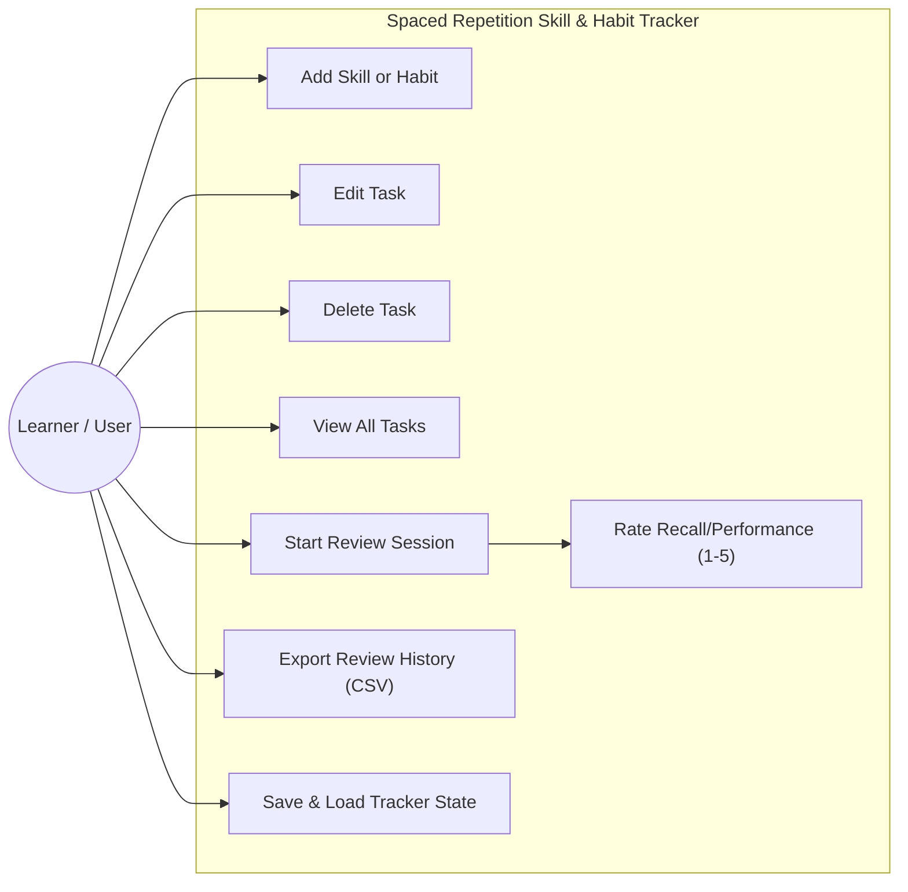
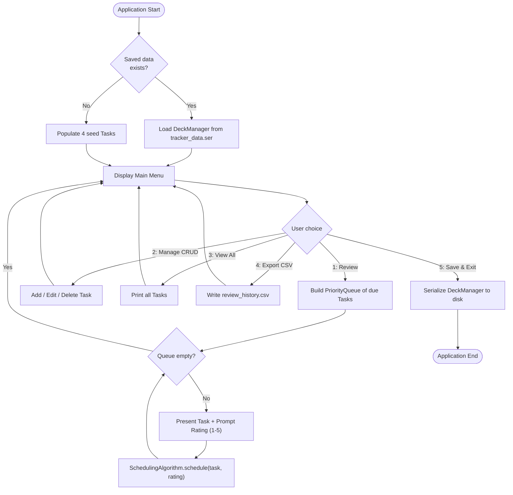
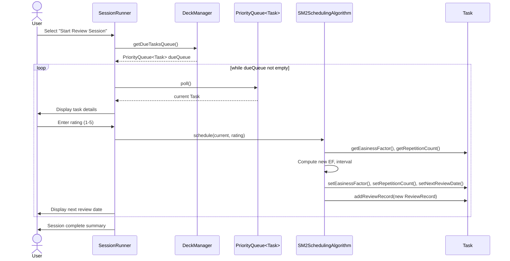

# PROJECT REPORT

---

## 1. Cover Page

**VIT BHOPAL UNIVERSITY**

**School of Computing Science and Engineering**

**Flipped Course Evaluation — Project Report**

**Project Title:** Spaced Repetition Skill & Habit Tracker

**Submitted in partial fulfilment of the requirements for the course
evaluation of [Course Name / Code — to be filled in by student]**

**Submitted by:**
Name: _______________________
Registration Number: _______________________
Program: B.Tech, School of Computing Science and Engineering

**Submitted to:**
Faculty Name: _______________________

**Institution:** VIT Bhopal University, Kotri Kalan, Sehore,
Madhya Pradesh, India

**Academic Year:** 2026

---

## 2. Introduction

Skill acquisition and habit formation both depend heavily on
*consistent, well-timed practice*. However, when a learner is
cultivating several unrelated skills at once — for example, a
technical discipline, a musical instrument, a fine-motor skill, and a
physical fitness routine — deciding when to revisit each one becomes a
non-trivial scheduling problem. Practising too often on an
already-mastered item wastes time; practising too rarely on a fragile,
newly-learned item leads to forgetting and regression.

The discipline of *spaced repetition*, most visibly used in
flashcard-based memorization tools such as Anki and SuperMemo,
addresses exactly this trade-off by dynamically expanding or
contracting the interval before the next review based on how well the
learner performed during the last one. This project extends that
well-established idea beyond rote memorization and applies it to the
broader domain of **skill and habit tracking**.

The result is a **Spaced Repetition Skill & Habit Tracker** — a
pure-Java, console-based application that lets a user register
skills and habits, run periodic review sessions, rate their own
recall or performance on a 1–5 scale, and let a SuperMemo-2 (SM-2)
derived algorithm compute the next optimal review date automatically.

## 3. Problem Statement

Learners lack a lightweight, adaptive tool for scheduling practice
across multiple, unrelated skills and habits simultaneously. Generic
to-do list and habit-tracking applications impose fixed, arbitrary
recurrence rules (e.g., "every day," "every Monday") that do not
respond to actual performance, causing either wasted repetition or
premature forgetting. This project addresses that gap by building a
console-based tracker that applies an SM-2 derived spaced repetition
algorithm — normally reserved for flashcard memorization — to
general-purpose skills and habits, using nothing beyond the standard
Java SE library.

## 4. Functional Requirements

The system is organized into three functional modules, as mandated by
the project brief:

### 4.1 Deck & Card Manager (CRUD for Habits/Skills)

- **Create:** Add a new `SkillTask` (with a name, description,
  category, and proficiency level) or a new `HabitTask` (with a name,
  description, and category).
- **Read:** List all tracked tasks, or list tasks filtered by
  category, via the underlying `Map<String, List<Task>>` structure.
- **Update:** Edit the name and description of an existing task,
  identified by its unique integer ID.
- **Delete:** Remove a task permanently from the deck by ID.

### 4.2 Scheduling Algorithm

- Accepts a quality rating from 1 (poor recall/performance) to 5
  (excellent recall/performance) for a task that has just been
  reviewed.
- Computes an updated *easiness factor* (EF), *repetition count*, and
  *interval* (in days) using an SM-2 derived formula.
- Computes the resulting *next review date* by adding the new interval
  to the current date (`java.time.LocalDate`).
- Appends an immutable `ReviewRecord` (date, rating, resulting
  interval) to the task's history for auditability.

### 4.3 Session Runner (Console UI)

- On startup, loads any previously saved state or, if none exists,
  initializes the four required seed entries.
- Presents a main menu: Start Review Session, Manage Skills/Habits,
  View All Tasks, Export Review History (CSV), Save & Exit.
- During a review session, builds a `PriorityQueue<Task>` of every
  task whose next review date is today or earlier, polls tasks in
  ascending order of due date, prompts for a 1–5 rating, and passes
  that rating to the Scheduling Algorithm.
- Reports the newly computed next review date back to the user after
  each rating is submitted.

## 5. Non-functional Requirements

**Reliability** — The application must not crash on malformed input
or missing save files. All console input is routed through a
validating utility (`InputValidator`) that loops until valid data is
entered, and file loading gracefully falls back to seed data if no
saved state exists or the save file is corrupted.

**Usability** — The console UI uses clearly numbered menus, consistent
prompts, and immediate confirmation messages (e.g., "[System] Task
added:") after every mutating action, so the user always knows the
result of their last command.

**Maintainability** — The codebase is organized into four clearly
separated packages (`models`, `engine`, `utils`, `main`), each with a
single responsibility. The scheduling algorithm is isolated behind a
`SchedulingAlgorithm` interface (Strategy pattern), so a different
algorithm could be substituted without modifying the `SessionRunner`
or `DeckManager`.

**Error Handling** — All file I/O operations are wrapped in
try-with-resources blocks with explicit `IOException` /
`ClassNotFoundException` handling; numeric console input is parsed
defensively with `NumberFormatException` handling and range checks;
invalid quality ratings passed programmatically to the scheduling
engine raise an `IllegalArgumentException` rather than silently
producing an incorrect schedule.

## 6. System Architecture

The application follows a simple layered architecture: a **Model**
layer (`models` package) representing domain data, an **Engine** layer
(`engine` package) containing business logic and the console UI
controller, a **Utility** layer (`utils` package) providing
cross-cutting services (file I/O, input validation, seed data), and a
thin **Main** entry point that wires the layers together.

```mermaid
flowchart TB
    subgraph MainLayer["main"]
        Main["Main.java\n(Application Entry Point)"]
    end

    subgraph EngineLayer["engine"]
        SessionRunner["SessionRunner\n(Console UI Controller)"]
        DeckManager["DeckManager\n(CRUD + Categorization)"]
        SchedulingAlgorithm["<<interface>>\nSchedulingAlgorithm"]
        SM2["SM2SchedulingAlgorithm\n(Strategy Implementation)"]
    end

    subgraph ModelLayer["models"]
        Task["Task\n(abstract)"]
        SkillTask["SkillTask"]
        HabitTask["HabitTask"]
        ReviewRecord["ReviewRecord"]
        Category["Category (enum)"]
    end

    subgraph UtilLayer["utils"]
        FileManager["FileManager\n(Serialization + CSV)"]
        InputValidator["InputValidator"]
        SeedDataInitializer["SeedDataInitializer"]
    end

    Main --> SessionRunner
    SessionRunner --> DeckManager
    SessionRunner --> SchedulingAlgorithm
    SessionRunner --> FileManager
    SessionRunner --> InputValidator
    SessionRunner --> SeedDataInitializer
    SchedulingAlgorithm <|.. SM2
    DeckManager --> Task
    SM2 --> Task
    SM2 --> ReviewRecord
    Task <|-- SkillTask
    Task <|-- HabitTask
    Task --> Category
    Task --> ReviewRecord
    FileManager --> DeckManager
    SeedDataInitializer --> DeckManager
```

At runtime, `Main` instantiates a single `SessionRunner`, which in
turn owns one `DeckManager` (the in-memory data store), one
`SchedulingAlgorithm` implementation, and one `FileManager`. Data
flows from the console, through `SessionRunner`, into `DeckManager`
and `SchedulingAlgorithm`, and is persisted back out through
`FileManager` on exit.

## 7. Design Diagrams

### 7.1 Use Case Diagram



### 7.2 Workflow Diagram



### 7.3 Sequence Diagram (Review Session)



### 7.4 Class Diagram

```mermaid
classDiagram
    class Task {
        <<abstract>>
        -int id
        -String name
        -String description
        -Category category
        -LocalDate creationDate
        -LocalDate nextReviewDate
        -int repetitionCount
        -double easinessFactor
        -int currentInterval
        -List~ReviewRecord~ history
        +getTaskType() String*
        +getProgressSummary() String*
        +compareTo(Task) int
        +addReviewRecord(ReviewRecord) void
    }

    class SkillTask {
        -String proficiencyLevel
        +getTaskType() String
        +getProgressSummary() String
    }

    class HabitTask {
        -int currentStreak
        -int longestStreak
        +incrementStreak() void
        +resetStreak() void
        +getTaskType() String
        +getProgressSummary() String
    }

    class ReviewRecord {
        -LocalDate reviewDate
        -int qualityRating
        -int resultingIntervalDays
    }

    class Category {
        <<enumeration>>
        TECHNICAL_SKILL
        MUSICAL_SKILL
        HANDWRITING
        PHYSICAL_FITNESS
    }

    class SchedulingAlgorithm {
        <<interface>>
        +schedule(Task, int) void
    }

    class SM2SchedulingAlgorithm {
        +schedule(Task, int) void
    }

    class DeckManager {
        -Map~String, List~Task~~ deck
        +addTask(Task) void
        +removeTaskById(int) boolean
        +findTaskById(int) Optional~Task~
        +getAllTasks() List~Task~
        +getDueTasksQueue() PriorityQueue~Task~
    }

    class FileManager {
        +saveDeckManager(DeckManager) void
        +loadDeckManager() DeckManager
        +exportHistoryToCsv(DeckManager) void
    }

    class SessionRunner {
        -DeckManager deckManager
        -SchedulingAlgorithm schedulingAlgorithm
        -FileManager fileManager
        +run() void
    }

    Task <|-- SkillTask
    Task <|-- HabitTask
    Task "1" o-- "many" ReviewRecord
    Task --> Category
    Task ..|> "Comparable~Task~"
    SchedulingAlgorithm <|.. SM2SchedulingAlgorithm
    DeckManager "1" o-- "many" Task
    SessionRunner --> DeckManager
    SessionRunner --> SchedulingAlgorithm
    SessionRunner --> FileManager
```

## 8. Design Decisions & Rationale

**Choice of `PriorityQueue` for the review queue.** A review session
must always process the most overdue task first and must exclude
tasks that are not yet due. Rather than sorting a full `List<Task>`
on every session (an O(n log n) operation performed eagerly), a
`PriorityQueue<Task>` — backed by a binary heap — is populated only
with currently-due tasks and relies on `Task`'s natural ordering
(`compareTo`, based on `nextReviewDate`) to always `poll()` the
soonest-due item next in O(log n) time. This keeps the Session Runner
module simple: it never has to manually sort or re-check dates once
the queue is built.

**Strategy Pattern for the scheduling algorithm.** The
`SchedulingAlgorithm` interface deliberately exposes a single method,
`schedule(Task, int)`, and is implemented by `SM2SchedulingAlgorithm`.
This decouples *how* a next review date is computed from *where* it is
used (the `SessionRunner`). It directly satisfies the "Maintainability"
non-functional requirement: a future implementation — e.g. a Leitner
box system, or a simple fixed-multiplier scheme — could be dropped in
by implementing the same interface, with zero changes required to
`SessionRunner` or `DeckManager`.

**Standard Java File I/O over an external database.** Because the
project brief mandates a "pure Java" application with no external SQL
database, persistence is implemented with `java.io.ObjectOutputStream`
/ `ObjectInputStream` for full-fidelity state saving (every `Task`
subtype, its history, and its scheduling state is preserved exactly),
supplemented by a `PrintWriter`-based CSV exporter for
human-readable, spreadsheet-friendly review history. This avoids any
external dependency while still satisfying both the "save/restore
state" and "inspect the data externally" needs of the project.

**Two `Task` subclasses (`SkillTask`, `HabitTask`) rather than one.**
Skills (e.g. a musical instrument) are naturally described by a
proficiency label, while habits (e.g. a calisthenics routine) are
naturally described by a day-to-day streak. Modelling these as two
subclasses of an abstract `Task` — rather than cramming both concepts
into one class with unused fields — demonstrates genuine inheritance
and polymorphism: the `SchedulingAlgorithm` and `DeckManager` operate
uniformly on `Task` references, while `getProgressSummary()` and
habit-specific streak updates behave differently depending on the
concrete runtime type.

## 9. Implementation Details

The system comprises 10 classes/interfaces/enums across four packages:

- **`models`** — `Category` (enum), `ReviewRecord`, `Task` (abstract,
  implements `Serializable` and `Comparable<Task>`), `SkillTask`,
  `HabitTask`.
- **`engine`** — `SchedulingAlgorithm` (interface),
  `SM2SchedulingAlgorithm`, `DeckManager`, `SessionRunner`.
- **`utils`** — `InputValidator`, `FileManager`,
  `SeedDataInitializer`.
- **`main`** — `Main`.

Key implementation notes:

- `Task` maintains a **static** `idCounter` to hand out unique IDs.
  Because static fields are not part of the serialized object graph,
  `SessionRunner` calls `Task.ensureIdCounterAbove(id)` for every
  restored task immediately after deserialization, guaranteeing newly
  created tasks in a resumed session never collide with previously
  saved IDs.
- The SM-2 formula is implemented exactly as published, with the
  quality scale re-interpreted so that a rating below 3 (out of 5) is
  treated as a failed recall — resetting the repetition counter and
  interval — while a rating of 3 or above advances the standard
  1-day → 6-day → `previousInterval × EF` progression.
- `DeckManager` stores tasks in a `Map<String, List<Task>>` keyed by
  `Category.name()`, satisfying the categorization requirement while
  still allowing an O(1) lookup of all tasks in a given category.
- All console output uses descriptive, bracket-tagged prefixes (e.g.
  `[System]`, `[Error]`, `[Input Error]`, `[Session]`, `[Scheduled]`)
  to make the CLI's state changes unambiguous during grading/demo.

## 10. Screenshots / Results

*(The following are placeholder descriptions of expected console
output. Replace each with an actual terminal screenshot before final
submission.)*

- **[Screenshot: Application Startup]** — Shows the banner
  "SPACED REPETITION SKILL & HABIT TRACKER (SM-2 Engine)" followed by
  the message confirming either that saved data was loaded or that
  seed data was initialized.
- **[Screenshot: Main Menu CLI]** — Shows the five main menu options
  (Start Review Session, Manage Skills/Habits, View All Tasks, Export
  CSV, Save & Exit) with a numeric prompt.
- **[Screenshot: Review Session in Progress]** — Shows a due task's
  full details (name, category, next review date, repetition count,
  easiness factor, description, progress summary) followed by the
  "Rate your recall/performance (1=Poor ... 5=Excellent):" prompt.
- **[Screenshot: Scheduling Confirmation]** — Shows the
  `[Scheduled]` message reporting the newly computed next review date
  and interval immediately after a rating is submitted.
- **[Screenshot: Deck Management Submenu]** — Shows the Add / Edit /
  Delete / Back options under "MANAGE SKILLS/HABITS."
- **[Screenshot: View All Tasks Output]** — Shows the formatted list
  of all tracked tasks, each on its own line with ID, name, category,
  next review date, repetition count, and easiness factor.
- **[Screenshot: CSV Export Confirmation]** — Shows the
  `[System] Review history exported to review_history.csv` message,
  alongside a spreadsheet view of the generated file.

## 11. Testing Approach

Testing focused primarily on verifying the correctness of the
scheduling mathematics, since this is the algorithmic core of the
project, supplemented by manual functional and boundary testing of
the console UI.

**Unit-style verification of `SM2SchedulingAlgorithm`:**

| Test Case | Input (rating, prior state) | Expected Outcome |
|---|---|---|
| First successful review | rating = 4, repetitions = 0 | repetitions → 1, interval → 1 day |
| Second successful review | rating = 5, repetitions = 1 | repetitions → 2, interval → 6 days |
| Third+ successful review | rating = 4, repetitions = 2, EF = 2.5, prior interval = 6 | interval → round(6 × 2.5) = 15 days |
| Failed recall resets progress | rating = 1, repetitions = 3 | repetitions → 0, interval → 1 day |
| Easiness factor floor | repeated low ratings (rating = 3 several times) | EF asymptotically approaches but never drops below 1.3 |
| Invalid rating rejected | rating = 0 or rating = 6 | `IllegalArgumentException` thrown |
| Habit streak increments on success | `HabitTask`, rating ≥ 3 | `currentStreak` increases by 1 |
| Habit streak resets on failure | `HabitTask`, rating < 3 | `currentStreak` resets to 0 |

Each case can be exercised by instantiating a `Task` subclass
directly, calling `schedule()` with the specified rating, and
asserting on the resulting `getCurrentInterval()`,
`getRepetitionCount()`, and `getEasinessFactor()` values (these
assertions can be wired into a `main`-based test harness or a proper
`JUnit` suite if the grading environment permits adding a test
dependency).

**Manual / functional testing of the console UI** covered: adding a
skill and a habit, editing an existing task's name/description,
deleting a task, running a full review cycle with mixed high and low
ratings, restarting the application to confirm persisted state, and
exporting/inspecting the CSV file.

**Boundary and negative testing** covered: submitting non-numeric
input at a menu prompt, submitting an out-of-range menu number,
submitting a rating outside 1–5, and attempting to edit/delete a
non-existent task ID — all of which were confirmed to produce a
graceful, re-prompting error message rather than an exception trace
or crash.

## 12. Challenges Faced

- **Preserving unique IDs across serialization.** Java's static
  fields are tied to the class, not to any serialized instance, so a
  naive `idCounter` would reset to 1 on every restart and could
  eventually collide with IDs already present in a restored save
  file. This was resolved by explicitly re-synchronizing the counter
  (`Task.ensureIdCounterAbove`) against every loaded task immediately
  after deserialization.
- **Adapting SM-2's 0–5 scale to the brief's 1–5 requirement.** The
  original SuperMemo-2 algorithm defines its easiness-factor formula
  and failure threshold in terms of a 0–5 quality scale. Since the
  project brief specifies a 1–5 rating, care was taken to re-derive
  the failure boundary (ratings below 3) and confirm the easiness
  factor formula still behaves sensibly (monotonically increasing for
  higher-quality ratings, floor-clamped at 1.3) across the shifted
  range.
- **Avoiding infinite loops / crashes on `Scanner` misuse.** Reading
  raw integers from `Scanner` throws `NumberFormatException` on
  non-numeric input, and mixing `nextInt()` with `nextLine()` is a
  classic source of skipped-input bugs. This was addressed by reading
  every line as a `String` via `nextLine()` and parsing defensively
  inside `InputValidator`, with a `while (true)` retry loop bounded by
  a guaranteed `return` on the first valid entry.
- **Designing a class hierarchy that is genuinely polymorphic rather
  than superficial.** An early draft used a single `Task` class with
  optional fields for both proficiency level and streak count. This
  was refactored into the current `SkillTask` / `HabitTask` split so
  that `getProgressSummary()` and streak-related behaviour are true
  overridden methods rather than conditional branches on a type flag.

## 13. Learnings & Key Takeaways

- Implementing the SM-2 algorithm from its published formula clarified
  how a small number of state variables (easiness factor, repetition
  count, interval) can encode a surprisingly adaptive scheduling
  policy without any machine learning or external state.
- Choosing `PriorityQueue` over a manually sorted list reinforced how
  selecting the right standard-library data structure for an access
  pattern (repeatedly removing the minimum element) simplifies
  calling code and improves algorithmic complexity.
- Applying the Strategy design pattern to the scheduling algorithm — a
  seemingly small abstraction — made it concretely clear how
  interface-driven design supports the SOLID Open/Closed Principle:
  new algorithms can be added without modifying existing, tested
  classes.
- Working through the serialization/static-field interaction was a
  practical lesson in the difference between object state and class
  state, and why persistence code must be written with that
  distinction in mind.
- Building a robust console UI without any UI framework highlighted
  how much defensive input handling is required to make even a
  "simple" text-based interface resilient to real user behaviour.

## 14. Future Enhancements

- **Graphical User Interface.** Migrate the console UI to JavaFX (or
  Swing) to provide calendar views of upcoming reviews, progress
  charts per skill, and drag-and-drop task management.
- **Database-backed persistence.** Replace or supplement Java
  serialization with an embedded database (e.g. SQLite via JDBC) to
  support more robust querying, partial updates, and multi-device
  sync.
- **Notifications/Reminders.** Integrate with the operating system's
  notification system or a scheduled background task to proactively
  remind the user when a skill or habit becomes due, rather than
  requiring the user to launch the application manually.
- **Configurable scheduling strategies.** Expose a menu option to
  switch between multiple `SchedulingAlgorithm` implementations (e.g.
  a Leitner-box strategy alongside SM-2), letting the user compare
  approaches.
- **Analytics dashboard.** Use the CSV-exported review history to
  generate visualizations (e.g. via a charting library) of easiness
  factor trends, streaks, and review frequency over time.
- **Cloud sync / multi-user support.** Extend persistence to a
  lightweight REST backend so a user's tracker state can follow them
  across devices.

## 15. References

1. Wozniak, P. A. (1990). *Optimization of learning*. SuperMemo World
   — original description of the SM-2 algorithm.
2. Oracle. *Java Platform, Standard Edition Documentation* —
   `java.util.PriorityQueue`, `java.time.LocalDate`, `java.io.Serializable`.
   https://docs.oracle.com/en/java/javase/
3. Gamma, E., Helm, R., Johnson, R., & Vlissides, J. (1994). *Design
   Patterns: Elements of Reusable Object-Oriented Software*
   (Strategy Pattern reference).
4. Anki Manual — *How Anki schedules cards*, for a modern,
   production-scale application of spaced repetition.
   https://docs.ankiweb.net/
5. VIT Bhopal University — Flipped Course Evaluation project
   guidelines (institution-provided rubric).
